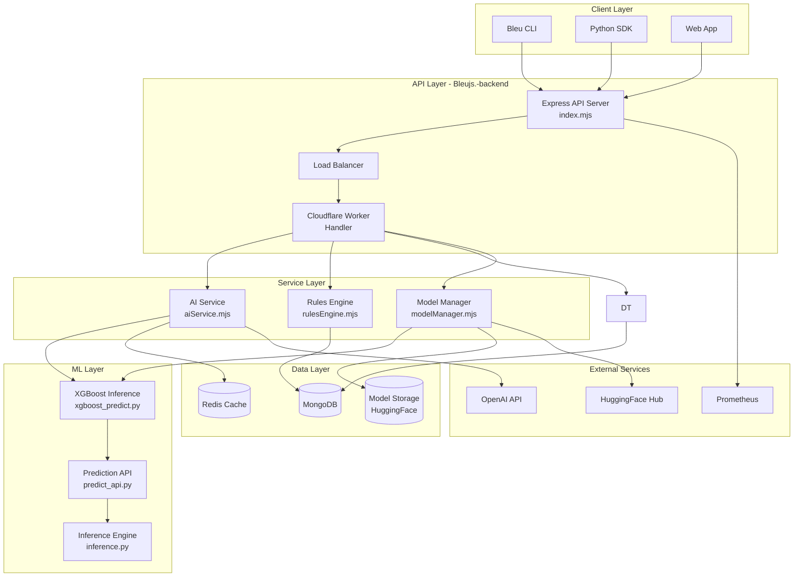
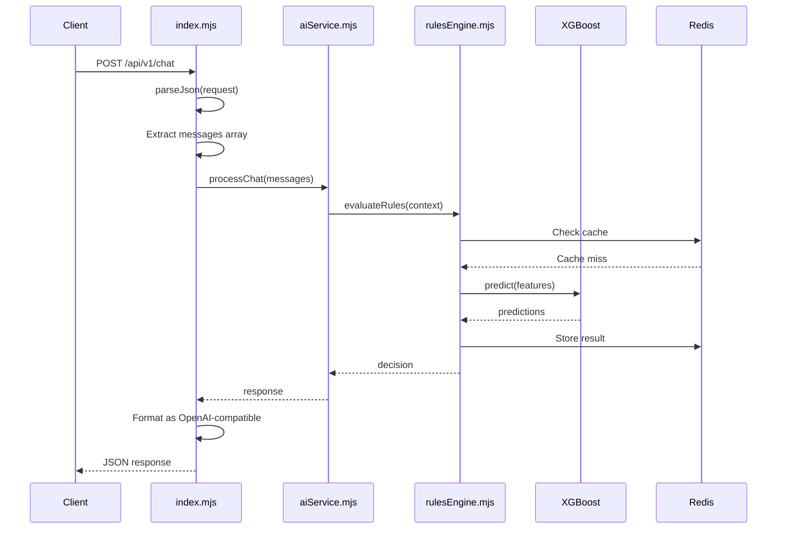
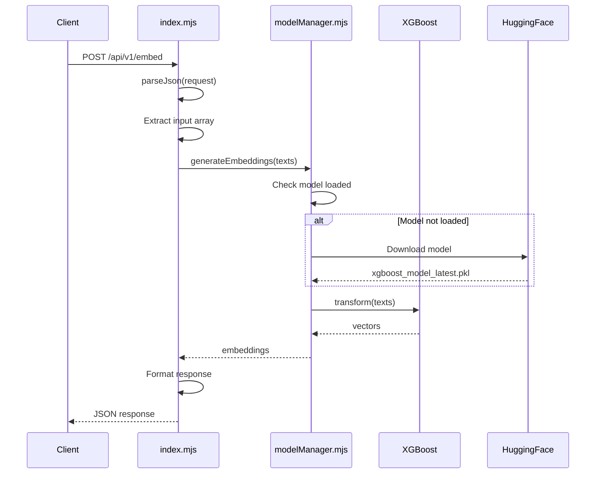
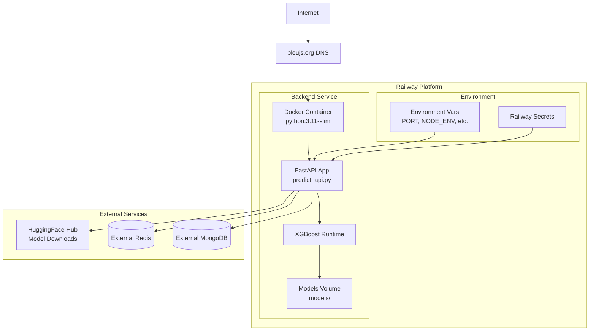
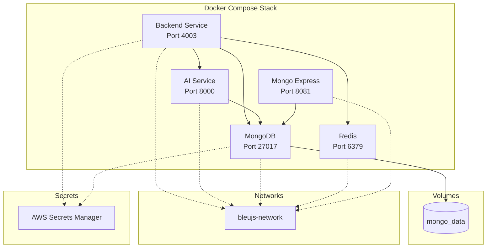
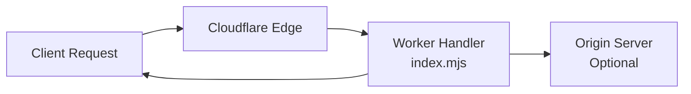
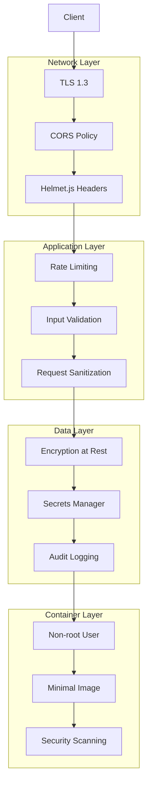

# Bleujs.-backend Architecture

**Version:** 1.2.0  
**Last Updated:** May 18, 2026  
**Status:** Production

---

## Table of Contents

- [Overview](#overview)
- [System Architecture](#system-architecture)
- [Component Diagram](#component-diagram)
- [API Architecture](#api-architecture)
- [Data Flow](#data-flow)
- [Deployment Architecture](#deployment-architecture)
- [Technology Stack](#technology-stack)
- [Service Components](#service-components)
- [Integration Points](#integration-points)
- [Performance Characteristics](#performance-characteristics)
- [Security Architecture](#security-architecture)

---

## Overview

The Bleujs.-backend provides the REST API server that powers the Bleu.js cloud platform. It serves as the backend for the Python SDK and CLI tools from the [main Bleu.js repository](https://github.com/HelloblueAI/Bleu.js).

**Key Responsibilities:**
- REST API endpoints for chat, generation, and embeddings
- XGBoost model serving and ML inference
- Rules engine and decision tree services
- Health monitoring and metrics collection

---

## System Architecture



---

## Component Diagram

```mermaid
graph LR
    subgraph "Entrypoints"
        IDX[index.mjs<br/>Cloudflare Worker<br/>Fetch Handler]
        SRV[server.mjs<br/>Local HTTP Server<br/>Port 4003]
    end

    subgraph "API Routes"
        HEALTH[/health]
        MODELS[/api/v1/models]
        CHAT[/api/v1/chat]
        GEN[/api/v1/generate]
        EMBED[/api/v1/embed]
    end

    subgraph "Core Services"
        AISVC[aiService.mjs]
        RULE[rulesEngine.mjs]
        MOCK[mockEngine.mjs]
    end

    subgraph "ML Services"
        XGBPRED[xgboost_predict.py]
        PREDAPI[predict_api.py]
        TRAIN[train_xgboost.py]
    end

    subgraph "Utilities"
        LOG[logger.mjs]
        MODELMGR[modelManager.mjs]
    end

    IDX --> HEALTH
    IDX --> MODELS
    IDX --> CHAT
    IDX --> GEN
    IDX --> EMBED

    SRV --> IDX

    CHAT --> AISVC
    GEN --> AISVC
    EMBED --> AISVC

    AISVC --> RULE
    AISVC --> DTSVC
    AISVC --> MOCK

    AISVC --> XGBPRED
    MODELMGR --> XGBPRED
    XGBPRED --> PREDAPI

    AISVC --> LOG
    RULE --> LOG
    DTSVC --> LOG
```

---

## API Architecture

### Entrypoint: `index.mjs`

The main API handler implements a Cloudflare Worker-style fetch interface:

```javascript
export default {
  async fetch(request, env, ctx) {
    // CORS handling
    // Route matching
    // Request parsing
    // Response formatting
  }
}
```

**Supported Routes:**

| Method | Endpoint | Purpose | Response |
|--------|----------|---------|----------|
| GET | `/` | Health check | Plain text status |
| GET | `/health` | Health status | `{"status": "healthy", "version": "1.0"}` |
| GET | `/api/v1/models` | List available models | `{"data": [models]}` |
| POST | `/api/v1/chat` | Chat completions | `{"choices": [{"message": {...}}]}` |
| POST | `/api/v1/generate` | Text generation | `{"text": "...", "id": "...", ...}` |
| POST | `/api/v1/embed` | Text embeddings | `{"data": [{"embedding": [...]}]}` |

### Local Server: `server.mjs`

Wraps the Cloudflare Worker handler in a Node.js HTTP server for local development:

```javascript
import handler from './index.mjs';
const server = http.createServer((req, res) => {
  // Convert Node.js request to Fetch API Request
  // Call handler.fetch()
  // Convert Response to Node.js response
});
```

**Default Port:** 4003 (configurable via `PORT` env var)

---

## Data Flow

### Chat Completion Flow



### Embedding Generation Flow



---

## Deployment Architecture

### Railway Deployment (Production)



**Key Characteristics:**
- **Platform:** Railway (managed hosting)
- **Cost:** ~$5/month
- **Scaling:** Vertical (single instance)
- **Port:** Dynamic (`$PORT` environment variable)
- **Health Check:** `GET /health`

### Docker Compose Deployment (Self-Hosted)



**Services:**
- `backend`: Express API (Node.js)
- `ai-service`: FastAPI prediction service
- `mongo`: MongoDB database
- `mongo-express`: MongoDB admin UI
- Shared network: `bleujs-network`
- AWS Secrets Manager integration

### Cloudflare Workers Deployment



**Characteristics:**
- Edge deployment (global)
- Serverless execution
- <50ms cold start
- No origin server required for static responses

---

## Technology Stack

### Backend (Node.js)

| Component | Technology | Version | Purpose |
|-----------|-----------|---------|---------|
| **Runtime** | Node.js | 20+ | JavaScript runtime |
| **Framework** | Express | 4.18.3 | HTTP server |
| **Language** | JavaScript (ESM) | ES2022+ | Module system |
| **Type Checking** | TypeScript | 5.6.3 | Static analysis |

### Backend (Python)

| Component | Technology | Version | Purpose |
|-----------|-----------|---------|---------|
| **Runtime** | Python | 3.11-3.12 | ML runtime |
| **ML Framework** | XGBoost | 3.0.2+ | Model inference |
| **API Framework** | FastAPI | Latest | Python API |
| **Server** | Uvicorn | Latest | ASGI server |
| **Data** | Pandas, NumPy | Latest | Data processing |

### Data & Caching

| Component | Technology | Purpose |
|-----------|-----------|---------|
| **Database** | MongoDB 8.x | Document storage |
| **Cache** | Redis 6.3+ | Session & response cache |
| **ODM** | Mongoose 8.2.1 | MongoDB models |
| **Client** | ioredis 5.10.0 | Redis client |

### Monitoring & Security

| Component | Technology | Purpose |
|-----------|-----------|---------|
| **Logging** | Winston 3.11.0 | Structured logging |
| **Metrics** | prom-client 15.1.0 | Prometheus metrics |
| **Security** | Helmet 7.1.0 | HTTP headers |
| **Rate Limiting** | express-rate-limit 7.1.5 | API throttling |

---

## Service Components

### AI Service (`src/services/aiService.mjs`)

**Responsibilities:**
- Process chat and generation requests
- Integrate with OpenAI API
- Coordinate with rules engine and XGBoost
- Manage conversation context

**Key Methods:**
- `processChat(messages)` - Handle chat completions
- `generateText(prompt)` - Generate text from prompt
- `createEmbedding(text)` - Create text embeddings

### Rules Engine (`src/services/rulesEngine.mjs`)

**Responsibilities:**
- Evaluate business rules
- Decision tree traversal
- Context-based routing
- Caching rule evaluations

**Key Methods:**
- `evaluateRules(context)` - Evaluate all applicable rules
- `applyRule(rule, context)` - Apply single rule
- `cacheResult(key, value)` - Cache rule evaluation

### Model Manager (`src/ml/modelManager.mjs`)

**Responsibilities:**
- Load XGBoost models from disk/HuggingFace
- Model versioning and caching
- Feature preprocessing
- Batch prediction

**Key Methods:**
- `loadModel(path)` - Load model from disk
- `predict(features)` - Run inference
- `downloadFromHub(repo_id)` - Download from HuggingFace

---

## Integration Points

### HuggingFace Hub Integration

```python
# scripts/download_model_from_hf.py
from huggingface_hub import hf_hub_download

hf_hub_download(
    repo_id="pejmantheory/bleu-xgboost-classifier",
    filename="xgboost_model_latest.pkl",
    local_dir="./models",
    token=os.environ.get("HF_TOKEN")
)
```

**Model Repositories:**
- Org: `helloblueai/bleu-xgboost-classifier`
- Personal: `pejmantheory/bleu-xgboost-classifier`

### OpenAPI Contract Alignment

The backend implements the API contract defined in the main repository:
- **Spec:** [openapi.yaml](https://github.com/HelloblueAI/Bleu.js/blob/main/docs/api/openapi.yaml)
- **Validation:** `tests/contract.mjs` verifies alignment
- **Documentation:** [API_CLIENT_GUIDE.md](https://github.com/HelloblueAI/Bleu.js/blob/main/docs/API_CLIENT_GUIDE.md)

### AWS Secrets Manager

```javascript
// Environment variables from AWS Secrets Manager
const secrets = {
  MONGODB_URI: process.env.MONGODB_URI,
  REDIS_URL: process.env.REDIS_URL,
  OPENAI_API_KEY: process.env.OPENAI_API_KEY
};
```

---

## Performance Characteristics

### Latency Benchmarks (Estimated)

| Endpoint | p50 | p95 | p99 | Notes |
|----------|-----|-----|-----|-------|
| `GET /health` | <10ms | <20ms | <50ms | No external calls |
| `GET /api/v1/models` | <10ms | <20ms | <50ms | Static list |
| `POST /api/v1/chat` | 50-100ms | 150ms | 300ms | Mock response |
| `POST /api/v1/generate` | 50-100ms | 150ms | 300ms | Mock response |
| `POST /api/v1/embed` | 100-200ms | 300ms | 500ms | Vector computation |
| **With XGBoost** | 200-500ms | 800ms | 1500ms | Model inference |

### Throughput

- **Express.js:** 1,000-5,000 req/s (depending on CPU)
- **Cloudflare Workers:** 10,000+ req/s (edge deployment)
- **Current bottleneck:** XGBoost CPU inference

### Scalability

**Horizontal Scaling:**
- ✅ Stateless API (can run multiple instances)
- ✅ Redis for shared session state
- ✅ MongoDB for shared data
- ✅ Load balancer ready

**Optimization Opportunities:**
- Response caching (Redis)
- Connection pooling (MongoDB, Redis)
- Request batching (XGBoost)
- CDN for static assets

---

## Security Architecture

### Security Layers



### Security Features

1. **CORS Configuration**
   ```javascript
   const CORS_HEADERS = {
     "Access-Control-Allow-Origin": "*", // ⚠️ Restrict in production
     "Access-Control-Allow-Methods": "GET, POST, OPTIONS",
     "Access-Control-Allow-Headers": "Content-Type, Authorization"
   };
   ```

2. **Docker Security**
   - Non-root user: `bleujs`
   - Slim base image: `python:3.11-slim-bookworm`
   - Pinned digest for reproducibility
   - Security upgrades at build time

3. **Secrets Management**
   - No secrets in repository
   - `.env.example` template
   - `.gitignore` excludes `.env*`
   - AWS Secrets Manager integration

4. **Rate Limiting**
   ```javascript
   const limiter = rateLimit({
     windowMs: 15 * 60 * 1000, // 15 minutes
     max: 100 // limit each IP to 100 requests per windowMs
   });
   ```

---

## Continuous Monitoring

### Health Checks

```bash
# Liveness probe
GET /health
→ {"status": "healthy", "version": "1.0"}

# Readiness probe
GET /
→ "Bleu.js Quantum-Enhanced AI Platform - Backend Ready"
```

### Prometheus Metrics

```javascript
import promClient from 'prom-client';

// Metrics to collect:
// - http_requests_total (counter)
// - http_request_duration_seconds (histogram)
// - xgboost_inference_duration_seconds (histogram)
// - active_connections (gauge)
```

### Logging

```javascript
import winston from 'winston';

const logger = winston.createLogger({
  level: process.env.LOG_LEVEL || 'info',
  format: winston.format.json(),
  transports: [
    new winston.transports.Console(),
    new winston.transports.File({ filename: 'error.log', level: 'error' }),
    new winston.transports.File({ filename: 'combined.log' })
  ]
});
```

---

## Development Workflow

### Local Development

```bash
# Install dependencies
npm install
pip install -r requirements.txt

# Download ML models
./scripts/setup_ml.sh --download

# Start local server
npm run dev  # Runs on http://localhost:4003

# Run tests
npm test
```

### Testing

```bash
# Run all tests
npm test

# Individual test suites
npm run test:smoke      # Entrypoint health
npm run test:api        # API endpoints
npm run test:contract   # OpenAPI alignment
```

### Deployment

```bash
# Build Docker image
docker build -t bleujs-backend .

# Run with Docker Compose
docker-compose up -d

# Deploy to Railway
git push railway main
```

---

## Future Architecture Considerations

### Potential Enhancements

1. **Microservices Split**
   - Separate XGBoost service
   - Dedicated rules engine service
   - Independent scaling

2. **Message Queue**
   - RabbitMQ or Redis Pub/Sub
   - Async job processing
   - Request batching

3. **API Gateway**
   - Kong or Traefik
   - Centralized auth
   - Rate limiting per API key

4. **Service Mesh**
   - Istio or Linkerd
   - Traffic management
   - Observability

---

## References

- [Main Bleu.js Repository](https://github.com/HelloblueAI/Bleu.js)
- [OpenAPI Specification](https://github.com/HelloblueAI/Bleu.js/blob/main/docs/api/openapi.yaml)
- [API Client Guide](https://github.com/HelloblueAI/Bleu.js/blob/main/docs/API_CLIENT_GUIDE.md)
- [Repository Health Report](REPOSITORY_HEALTH_REPORT.md)

---

**Last Updated:** May 18, 2026  
**Maintainers:** HelloblueAI Backend Team
